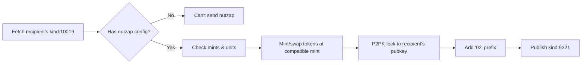
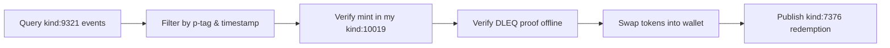

# Study Notes: NIP-60, NIP-61, and applesauce-wallet

**Date**: 2026-01-14
**Topic**: Cashu Wallets on Nostr and Nutzaps

---

## Table of Contents
1. [Overview](#overview)
2. [NIP-60: Cashu Wallets](#nip-60-cashu-wallets)
3. [NIP-61: Nutzaps](#nip-61-nutzaps)
4. [applesauce-wallet Implementation](#applesauce-wallet-implementation)
5. [Integration & Workflows](#integration--workflows)
6. [Key Takeaways](#key-takeaways)

---

## Overview

### What is Cashu?
Cashu is an ecash protocol that enables private, decentralized digital cash using Chaumian blind signatures. Mints issue tokens that can be transferred peer-to-peer without the mint knowing who holds them.

### How Nostr Fits In
NIP-60 and NIP-61 integrate Cashu with Nostr by:
- Storing wallet state on Nostr relays (NIP-60)
- Enabling peer-to-peer ecash transfers over Nostr (NIP-61)
- Making wallets portable across applications
- Providing cryptographic proof of payments

---

## NIP-60: Cashu Wallets

**Purpose**: Define operations for Cashu-based wallets stored on relays

**Benefits**:
- **Ease-of-use**: New users can immediately receive funds without creating accounts
- **Interoperability**: Wallets follow users across applications
- **Decentralization**: No single point of failure or control

### Core Event Kinds

#### 1. Wallet Event (kind:17375)
**Type**: Replaceable event
**Purpose**: Stores wallet configuration

**Structure**:
```json
{
  "kind": 17375,
  "tags": [
    ["privkey", "<private-key>"],  // Distinct key for P2PK ecash (NOT user's Nostr key)
    ["mint", "<mint-url>"],         // Required: one or more mint URLs
    ["mint", "<another-mint-url>"]
  ],
  "content": "<NIP-44 encrypted data>"
}
```

**Important Notes**:
- Uses NIP-44 encryption (NOT NIP-04)
- Private key is exclusively for the wallet, separate from Nostr identity
- Multiple mints can be configured
- Replaceable: latest version overwrites previous

#### 2. Token Event (kind:7375)
**Type**: Regular event
**Purpose**: Records unspent proofs

**Structure**:
```json
{
  "kind": 7375,
  "tags": [
    ["a", "<wallet-coordinate>"]  // References parent wallet
  ],
  "content": "<NIP-44 encrypted>"
}
```

**Encrypted Content Format**:
```json
{
  "mint": "https://mint.example.com",
  "unit": "sat",  // Default: sat, can be usd, eur, etc.
  "proofs": [
    {
      "id": "<keyset-id>",
      "amount": 1000,
      "secret": "<secret>",
      "C": "<point>"
    }
  ],
  "del": ["<token-id-1>", "<token-id-2>"]  // Deleted token IDs for state tracking
}
```

**Important Notes**:
- Multiple token events per mint allowed
- `del` field tracks destroyed tokens to prevent double-spending
- Proofs are unencoded objects (not cashu token strings)

#### 3. Spending History Event (kind:7376)
**Type**: Regular event
**Purpose**: Optional transaction log

**Encrypted Content**:
```json
{
  "direction": "in",  // or "out"
  "amount": 1000,
  "unit": "sat",
  "e": ["<token-event-id>"]  // References created/destroyed/redeemed tokens
}
```

#### 4. Quote Event (kind:7374)
**Type**: Ephemeral/temporary
**Purpose**: Tracks pending mint quotes

**Structure**:
```json
{
  "kind": 7374,
  "tags": [
    ["expiration", "<unix-timestamp>"]  // Max 2 weeks suggested
  ],
  "content": "<NIP-44 encrypted quote data>"
}
```

### State Management Flow

**When Spending Proofs**:
1. Client deletes original token event using NIP-09 (kind:5)
2. Client creates new token event with remaining unspent proofs
3. Deleted token IDs added to new event's `del` field
4. Optionally publish kind:7376 history event

**State Validation**:
- Clients should validate proofs to detect previous spending
- Check `del` fields across token events to track state transitions
- Handle race conditions when multiple clients spend simultaneously

---

## NIP-61: Nutzaps

**Purpose**: P2PK-locked Cashu transfers over Nostr (the payment IS the receipt)

**Key Difference from NIP-60**:
- NIP-60: Private wallet storage (encrypted)
- NIP-61: Public ecash transfers (visible but locked)

**Characteristics**:
- Tokens are NOT encrypted
- Anyone can see the payload
- Only holder of private key can spend them
- Requires user opt-in via kind:10019

### Event Kinds

#### 1. User Configuration (kind:10019)
**Type**: Replaceable event
**Purpose**: Signal how to receive nutzaps

**Structure**:
```json
{
  "kind": 10019,
  "tags": [
    ["relay", "wss://relay1.com"],
    ["relay", "wss://relay2.com"],
    ["mint", "https://mint.example.com"],
    ["mint", "https://another-mint.com", "usd"],  // Optional unit marker
    ["pubkey", "<p2pk-pubkey>"]  // Separate from Nostr pubkey!
  ],
  "content": ""
}
```

**Important Notes**:
- **Must opt-in**: No kind:10019 = don't want nutzaps
- `pubkey` tag is separate key exclusively for wallet (security!)
- Multiple mints = user accepts tokens from any listed mint
- Unit markers filter by denomination (default: sat)

#### 2. Nutzap Event (kind:9321)
**Type**: Regular event
**Purpose**: Published by sender with ecash proofs

**Structure**:
```json
{
  "kind": 9321,
  "tags": [
    ["p", "<recipient-pubkey>"],  // Nostr pubkey of recipient
    ["proof", "<cashu-token-1>"],  // P2PK-locked proofs
    ["proof", "<cashu-token-2>"],
    ["u", "<mint-url>"],  // Must match recipient's kind:10019
    ["unit", "sat"],  // Default: sat
    ["e", "<event-id>"]  // Optional: event being nutzapped
  ],
  "content": "Great post! 🔥"  // Optional message
}
```

**Critical Implementation Requirements**:
1. **MUST** prefix P2PK pubkeys with "02" for Cashu compatibility
2. **SHOULD** validate mint is in recipient's kind:10019
3. **MUST** use NUT-11 (P2PK) and NUT-12 (DLEQ) compatible mints
4. Proofs must be P2PK-locked to recipient's wallet pubkey

#### 3. Redemption Record (kind:7376)
**Type**: Regular event
**Purpose**: Published by recipient after claiming

**Structure**:
```json
{
  "kind": 7376,
  "tags": [
    ["e", "<nutzap-event-id-1>"],
    ["e", "<nutzap-event-id-2>"]
  ],
  "content": "<NIP-44 encrypted redemption data>"
}
```

**Best Practice**:
- Publish to sender's NIP-65 read relays
- Encrypted content tracks amount, unit, direction
- Prevents double-redemption attempts

### Sending Flow



### Reception Flow



### Security Considerations

**Offline Validation**:
- Clients **MUST** verify DLEQ proofs before counting nutzaps
- Don't trust sender's claims about amounts
- Validate cryptographic proofs independently

**Pubkey Prefix**:
- P2PK pubkeys must be prefixed with "02" for Cashu compatibility
- This is a protocol requirement, not optional

**Mint Validation**:
- Only accept tokens from mints in your kind:10019
- Unknown mints = potential scam/worthless tokens
- Verify mint supports NUT-11 and NUT-12

---

## applesauce-wallet Implementation

**Source**: [hzrd149/applesauce](https://github.com/hzrd149/applesauce)
**Documentation**: [Wallet Guide](https://hzrd149.github.io/applesauce/wallet/getting-started.html)

### Overview

applesauce-wallet is part of the Applesauce library suite for building Nostr web clients. It provides:
- Actions and queries for managing NIP-60 wallets
- Cashu token handling
- Integration with the broader Applesauce ecosystem

**Current Status**:
- Work-in-progress (as of v5.0.0)
- Still missing many features
- Used in production by noStrudel client

### Key Features (v5.0.0)

From the Applesauce v5.0.0 release:
- **NIP-87 Support**: Cashu mint discovery
- **Core Integration**: Works with applesauce-core event store
- **Reactive Patterns**: RxJS observables for wallet state
- **Signing Integration**: Works with applesauce-signers

### Architecture Integration

**Applesauce Suite Components**:
1. **applesauce-core**: Event store, queries, observables
2. **applesauce-wallet**: NIP-60 wallet management + Cashu tokens
3. **applesauce-signers**: NIP-07, NIP-46 signing
4. **applesauce-factory**: Event creation helpers
5. **applesauce-common**: Social/NIP-specific helpers
6. **applesauce-react**: React hooks and components

**Typical Usage Pattern**:
```typescript
import { EventStore } from "applesauce-core";
import { use$ } from "applesauce-react/hooks";
// Wallet imports would go here (API not fully documented yet)

// EventStore singleton
const eventStore = new EventStore();

// React component
function WalletComponent() {
  // Subscribe to wallet state (reactive)
  const walletEvent = use$(() =>
    eventStore.replaceable(17375, userPubkey),
    [userPubkey]
  );

  // Wallet operations...
}
```

### Installation

```bash
npm install applesauce-wallet
# or
yarn add applesauce-wallet
# or
pnpm add applesauce-wallet
```

### Comparison: NDK Wallet vs Applesauce Wallet

**Alternative**: [@nostr-dev-kit/ndk-wallet](https://www.npmjs.com/package/@nostr-dev-kit/ndk-wallet)

| Feature | applesauce-wallet | ndk-wallet |
|---------|-------------------|------------|
| Status | Work-in-progress | More mature |
| Ecosystem | Applesauce suite | NDK suite |
| NIP-60 | Yes | Yes |
| NIP-61 | In development | Yes |
| React Hooks | applesauce-react | @nostr-dev-kit/ndk-react |

---

## Integration & Workflows

### Complete Nutzap Workflow

**1. Recipient Setup**:
```typescript
// User creates kind:10019 configuration
const walletConfig = {
  kind: 10019,
  tags: [
    ["relay", "wss://relay.damus.io"],
    ["mint", "https://mint.minibits.cash"],
    ["mint", "https://testnut.cashu.space", "sat"],
    ["pubkey", "<separate-p2pk-pubkey>"]
  ],
  content: ""
};
```

**2. Sender Discovers Recipient**:
```typescript
// Fetch recipient's configuration
const recipientConfig = await eventStore.replaceable(10019, recipientPubkey);

// Extract mint preferences
const mints = recipientConfig.tags
  .filter(t => t[0] === "mint")
  .map(t => ({ url: t[1], unit: t[2] || "sat" }));

// Get P2PK pubkey
const p2pkPubkey = recipientConfig.tags.find(t => t[0] === "pubkey")?.[1];
```

**3. Sender Creates Nutzap**:
```typescript
// Mint tokens at compatible mint
const proofs = await mintTokens(mints[0].url, 1000);

// P2PK-lock to recipient
const lockedProofs = proofs.map(p =>
  p2pkLock(p, "02" + p2pkPubkey)  // Note: "02" prefix!
);

// Publish nutzap event
const nutzap = {
  kind: 9321,
  tags: [
    ["p", recipientPubkey],
    ...lockedProofs.map(p => ["proof", p]),
    ["u", mints[0].url],
    ["unit", "sat"]
  ],
  content: "Thanks for the great content!"
};
```

**4. Recipient Claims Nutzap**:
```typescript
// Query incoming nutzaps
const nutzaps = await eventStore.timeline([
  { kinds: [9321], "#p": [myPubkey], since: lastCheck }
]);

// Verify and swap each nutzap
for (const nutzap of nutzaps) {
  const proofs = nutzap.tags.filter(t => t[0] === "proof").map(t => t[1]);

  // Verify DLEQ proofs offline
  const valid = await verifyDLEQ(proofs);
  if (!valid) continue;

  // Swap into wallet
  await swapToWallet(proofs);

  // Publish redemption record
  await publishRedemption(nutzap.id);
}
```

### NIP-60 Wallet State Management

**Creating a Wallet**:
```typescript
// Generate separate wallet keypair
const walletKeypair = generateKeypair();

// Create wallet event
const wallet = {
  kind: 17375,
  tags: [
    ["privkey", walletKeypair.privateKey],
    ["mint", "https://mint.minibits.cash"],
    ["mint", "https://testnut.cashu.space"]
  ],
  content: await nip44Encrypt(walletData, userPrivkey)
};
```

**Updating Token State**:
```typescript
// When spending proofs:
// 1. Delete old token event
await publishDeletion(oldTokenEventId);

// 2. Create new token event with remaining proofs
const newTokenEvent = {
  kind: 7375,
  tags: [
    ["a", `17375:${userPubkey}:${walletId}`]
  ],
  content: await nip44Encrypt({
    mint: mintUrl,
    unit: "sat",
    proofs: remainingProofs,
    del: [...previousDel, oldTokenEventId]  // Track deleted tokens
  }, userPrivkey)
};
```

### Integration with Grimoire

**Potential Use Cases**:
1. **Wallet Viewer**: Display NIP-60 wallets as windows
2. **Nutzap Feed**: Show incoming/outgoing nutzaps
3. **Mint Explorer**: Discover and evaluate Cashu mints
4. **Payment Integration**: Send nutzaps to content creators

**Example Command**:
```bash
# View wallet
wallet <npub>

# View nutzaps for event
nutzaps -e <note-id>

# Send nutzap
zap <amount> -p <npub> --cashu
```

---

## Key Takeaways

### NIP-60 (Cashu Wallets)
✅ Stores wallet state on relays (encrypted with NIP-44)
✅ Uses separate private key for P2PK ecash (NOT Nostr key)
✅ Multiple event types: wallet config, tokens, history, quotes
✅ State management via `del` field prevents double-spending
✅ Enables cross-app wallet portability

### NIP-61 (Nutzaps)
✅ P2PK-locked ecash transfers (visible but locked)
✅ Requires opt-in via kind:10019
✅ Payment IS the receipt (cryptographic proof)
✅ MUST verify DLEQ proofs offline before trusting
✅ Pubkeys must be prefixed with "02" for Cashu compatibility

### applesauce-wallet
✅ Part of hzrd149's Applesauce library suite
✅ Work-in-progress (v5.0.0) with NIP-87 mint discovery
✅ Reactive patterns using RxJS observables
✅ Integrates with applesauce-core event store
✅ Used in production by noStrudel

### Security Best Practices
🔒 Always use separate keypair for wallet (never reuse Nostr key)
🔒 Verify DLEQ proofs before trusting nutzaps
🔒 Use NIP-44 encryption (NOT deprecated NIP-04)
🔒 Validate mints against recipient's kind:10019
🔒 Track state with `del` field to prevent double-spending

### Implementation Considerations
⚠️ applesauce-wallet is work-in-progress (consider ndk-wallet for production)
⚠️ Cashu requires mint trust (choose reputable mints)
⚠️ NIP-61 requires NUT-11 and NUT-12 mint support
⚠️ State synchronization across clients can be challenging
⚠️ Privacy trade-offs: NIP-61 tokens are publicly visible

---

## Resources

### Official Specifications
- [NIP-60: Cashu Wallets](https://github.com/nostr-protocol/nips/blob/master/60.md)
- [NIP-61: Nutzaps](https://github.com/nostr-protocol/nips/blob/master/61.md)
- [NIP-44: Encrypted Payloads](https://github.com/nostr-protocol/nips/blob/master/44.md)
- [NIP-87: Cashu Mint Discovery](https://github.com/nostr-protocol/nips/blob/master/87.md)

### Libraries & Tools
- [hzrd149/applesauce](https://github.com/hzrd149/applesauce) - Applesauce library suite
- [Applesauce Documentation](https://hzrd149.github.io/applesauce/)
- [@nostr-dev-kit/ndk-wallet](https://www.npmjs.com/package/@nostr-dev-kit/ndk-wallet) - Alternative implementation
- [Awesome Cashu](https://github.com/cashubtc/awesome-cashu) - Cashu resources

### Community
- [NIP-60/61 Pull Request](https://github.com/nostr-protocol/nips/pull/1369) - Original proposal discussion
- [SatShoot v0.2.0](https://www.nobsbitcoin.com/satshoot-v0-2-0/) - Example implementation

---

**Study Session Completed**: 2026-01-14
**Next Steps**:
- Explore applesauce-wallet source code
- Build proof-of-concept nutzap integration
- Test with Cashu testnet mints
- Consider implementing wallet viewer in Grimoire
